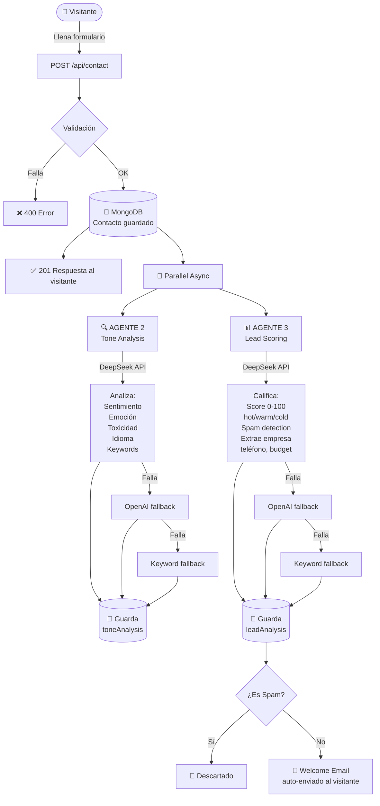
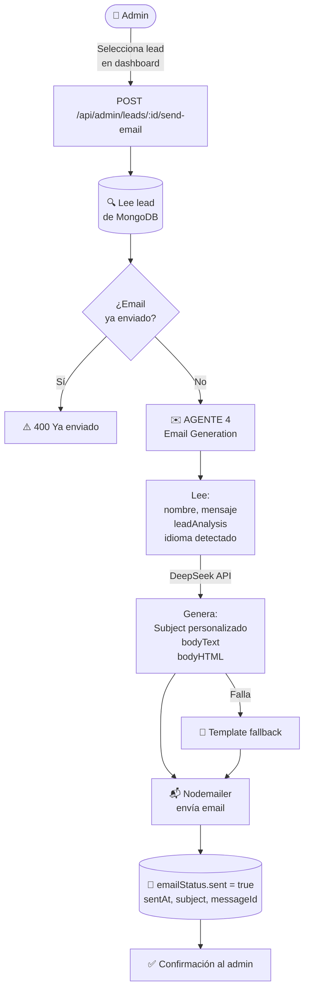
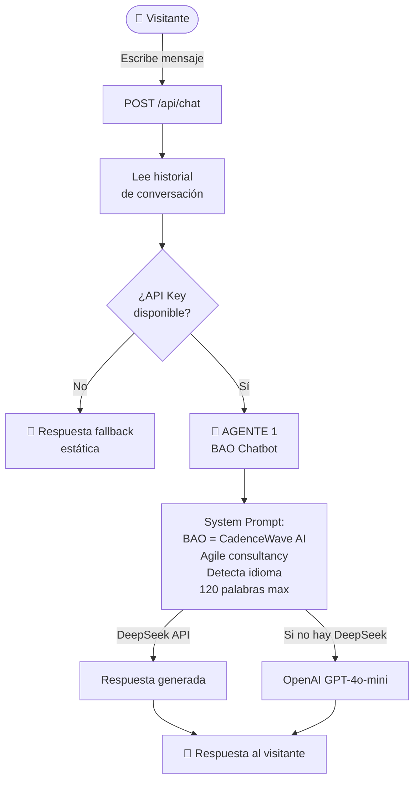
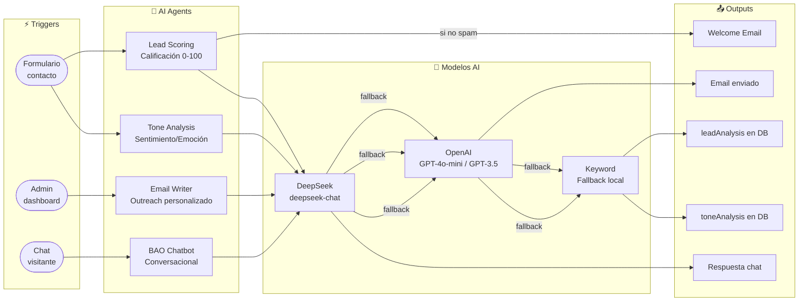
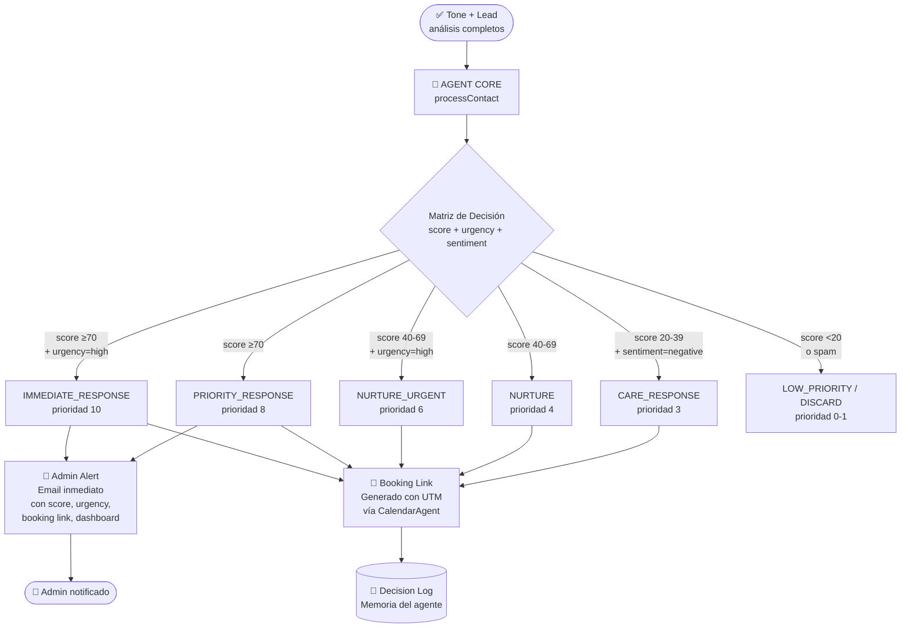

# CadenceWave — AI Agents Workflow

## Visión General

La aplicación cuenta con **6 agentes/servicios de AI** organizados bajo un **Agent Core** central, usando DeepSeek (primario) u OpenAI (fallback) como modelos base.

```
                    ┌─────────────────────────────┐
                    │        AGENT CORE           │
                    │  (Orquestador Central)       │
                    │  • Matriz de decisión        │
                    │  • Interpretación score+     │
                    │    urgency+sentiment         │
                    │  • Planificación de acciones │
                    │  • Memoria (decision log)    │
                    │  • Coordinación de agentes   │
                    └──────────┬──────────────────┘
                               │
           ┌───────────────────┼───────────────────┐
           ▼                   ▼                   ▼
   ┌───────────────┐  ┌────────────────┐  ┌──────────────────┐
   │  Admin Alert  │  │ Calendar Agent │  │   BAO Chatbot    │
   │  (emailSvc)   │  │  booking links │  │  (conversacional)│
   └───────────────┘  └────────────────┘  └──────────────────┘
           ▲
  ┌────────┴────────┐
  │  Tone Analysis  │  ← paralelo
  │  Lead Scoring   │  ← paralelo
  └─────────────────┘
```

---

## Pipeline 1 — Formulario de Contacto (Automático)



---

## Pipeline 2 — Admin Panel: Outreach Email (Manual)



---

## Pipeline 3 — BAO Chatbot (Tiempo Real)



---

## Vista Completa — Todos los Agentes



---

## Tabla de Agentes

| Agente | Trigger | Modelo primario | Fallback 1 | Fallback 2 | Output |
|--------|---------|-----------------|------------|------------|--------|
| **BAO Chatbot** | Mensaje en chat | DeepSeek | GPT-4o-mini | Texto estático | Respuesta conversacional |
| **Tone Analysis** | Contacto recibido | DeepSeek | GPT-3.5-turbo | Keywords locales | `toneAnalysis` en MongoDB |
| **Lead Scoring** | Contacto recibido | DeepSeek | GPT-4o-mini | Keywords locales | `leadAnalysis` en MongoDB |
| **Email Writer** | Admin lo activa | DeepSeek | GPT-4o-mini | Template HTML | Email enviado vía Nodemailer |

---

---

## Pipeline 4 — Agent Core (Orquestador Post-Análisis)



---

## Pipeline 5 — Calendar Agent (Scheduling)

```mermaid
flowchart TD
    A([Trigger]) -->|AgentCore\nou admin| GL[CalendarAgent\ngenerateLink]
    GL --> URL[URL personalizada\ncon name, email, UTMs]
    URL --> CH{Canal}
    CH -->|Email admin alert| AE[📧 Incluida en alerta]
    CH -->|BAO chatbot| BC[💬 BAO la comparte\ncuando detecta intento]
    CH -->|Admin manual| AM[🔗 /api/admin/leads/:id/booking-link]
    CH -->|Click del lead| TR[/api/booking/redirect\ntrack + redirect]
    TR --> CL[(📊 Click tracking\nen memoria)]
```

---

## Matriz de Decisión del Agent Core

| Score | Urgency | Sentiment | Acción | Pasos ejecutados |
|-------|---------|-----------|--------|-----------------|
| ≥70 | high | any | `IMMEDIATE_RESPONSE` (P:10) | Admin alert + Booking link |
| ≥70 | med/low | any | `PRIORITY_RESPONSE` (P:8) | Admin alert + Booking link |
| 40-69 | high | any | `NURTURE_URGENT` (P:6) | Booking link |
| 40-69 | med/low | any | `NURTURE` (P:4) | Booking link |
| 20-39 | any | negative | `CARE_RESPONSE` (P:3) | Booking link |
| <20 | any | any | `LOW_PRIORITY` (P:1) | Ninguno |
| any | any | any | `DISCARD` (P:0) | Ninguno (spam) |

---

## Tabla de Agentes (Actualizada)

| # | Agente | Trigger | Modelo / Tech | Output |
|---|--------|---------|---------------|--------|
| 1 | **BAO Chatbot** | Mensaje en chat | DeepSeek / GPT-4o-mini | Respuesta conversacional + booking link |
| 2 | **Tone Analysis** | Formulario enviado | DeepSeek / GPT-3.5 / Keywords | `toneAnalysis` en MongoDB |
| 3 | **Lead Scoring** | Formulario enviado | DeepSeek / GPT-4o-mini / Keywords | `leadAnalysis` en MongoDB |
| 4 | **Email Writer** | Admin lo activa | DeepSeek / GPT-4o-mini / Template | Email AI personalizado vía Resend |
| 5 | **Agent Core** | Después de análisis | Lógica determinista | Admin alert + booking link + decision log |
| 6 | **Calendar Agent** | AgentCore / Admin / BAO | URL generation + tracking | Booking links personalizados + click stats |

---

## Variables de Entorno Requeridas

| Variable | Descripción | Ejemplo |
|----------|-------------|---------|
| `BOOKING_URL` | URL de Calendly / Cal.com | `https://calendly.com/tu-usuario` |
| `ADMIN_EMAIL` | Email del admin para alertas HOT | `admin@cadencewave.io` |
| `BOOKING_DURATION` | Duración de la llamada (min) | `30` |
| `ADMIN_URL` | URL del dashboard admin | `https://cadencewave.io/admin` |

---

## Notas de Arquitectura

- **Agentes 2 y 3** corren en **paralelo** (`Promise.all`) — el AgentCore espera a ambos antes de actuar
- **Cadena de fallback** garantiza respuesta incluso sin API keys
- **Decision log** (últimas 100 decisiones) accesible via `GET /api/admin/agent-core/log`
- **Booking redirect** trackea clicks via `GET /api/booking/redirect?email=X&source=Y`
- **Cache de emails** (`Map`) evita regenerar el mismo email para el mismo lead
- **Token tracking** en Tone Analysis registra uso y costo en tiempo real
- Todos los agentes detectan el **idioma del usuario** y responden en consecuencia (ES/EN)
